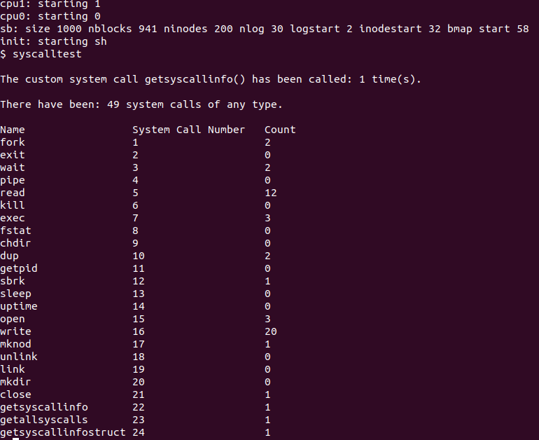
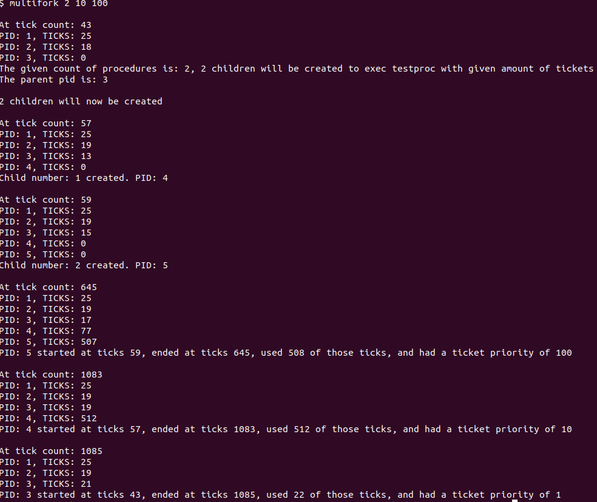
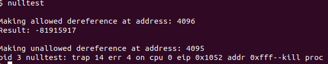
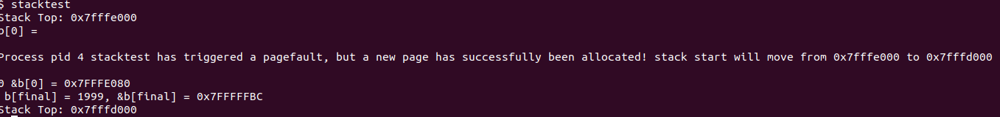

# Operating Systems Project

## Intro

This repository is a collection of projects completed for the course ICS462 Operating Systems at Metropolitan State University.

It consists of three projects:

1. Introduction to xv6 (Systemcalls)
2. xv6 Scheduler (Scheduling)
3. The Null Pointer and Other Tricks (VirtualMemory)

All three projects were built for/using the xv6 OS implemented by the Parallel and Distributed Operating Systems group at MIT CSAIL.
A link to their version of xv6 can be found [here](https://github.com/mit-pdos/xv6-public).

As directed in the course, these projects were built to be assumed to be run on a linux machine or virtual machine with an x86_64 cpu.
The machine must have qemu, gcc, and qemu-system-x86 installed. Adjustments can be made to run these projects on other machines by adjusting the makefile, view the xv6 repo linked above for more information.

Sample output will be shown for each project in the appropriate directory, the projects can be fully tested in a linux machine or virtual machine by downloading the project, traversing to the approriate xv6-private directory, running the make command, and finally running make qemu (for a gui version) or make qemu-nox (to run in the current terminal). Each project directory contains a README file to describe proper usage and testing of the code I have implemented.

## Skills learned while completing these projects

* Research
	* The learning done in calss was largely theoretical, so a huge part of completing these projects was taking a concept and researching how to actually implement it in a specific system using a specfic language. Figuring out how to do something was as much, if not more, work than than figuring out what I needed to do for a project. Strong research skills and the ability to pinpoint "what" to search for were hugely important skills.
* Debugging
	* Use of GDB
	* These projects contained a lot of learning by doing and trial-and-error. Being able to use a debugger, in this case the GNU Debugger, effectively was an invaluable tool for learning what was going right and wrong while experimenting with these projects.
* C programming
* OS/kernal programming

## Basic Project Descriptions

### Project 1 - Introduction to xv6

The goal given by this project was to implement a custom system call in the xv6 Operating System that would return how many times this custom has been called (incrementing the count before returning a value).

To complete this project I:
* Researched how to implement system calls in xv6
* Created three system calls and all neccesary parts of implementing them
	* One that would perform the inital requirements of the project - returning how many times itself has been called
	* One that would return an array of integers where the index is the OS's system call number for that system call, and the value is the amount of times it has been called - to be used to show how many times each and every system call has been made
	* One that takes a struct and sets it values so that each index would have a name for the function, an integer value for the syscall number, and an integer value for the amount of times it has been called (incomplete, currently only being used for hardcoded system call function names)
* Created a user program for testing and printing the results of using the system calls
	* Including a very simple but cool function for indenting strings of different lengths so that each column would line up properly
		* (needs some work to be polished into a version that can be easily reused for future projects

##### Example Output

This image show the output of running my user program syscalltest, which shows how many times the getsyscallinfo system call has been made, how many system calls in general have been made, and a table showing the 21 built in system calls plus my 3 custom system calls, their system call number, and a count of how many times each system call has been made.

### Project 2 - xv6 Scheduler

This project updates the scheduler being used in the xv6 OS from using a basic round robin scheduler to one that uses a combination of a multi-level feedback queue and lottery scheduling.

The basic idea of the project is that there are two queues of processes to be run - a high priority queue for new processes, and a low priority queue for old processes. A new process should be scheduled once on the high queue before moving to and remaining on the low queue. A process on the low priority queu should always run for two schedulings before relinquishing the scheduler. Each process is given a priority weight upon creation (which can be updated via a system call), measured as an integer amount of 'tickets'. Each time the scheduler runs, it should attempt to run a proccess in the high priority que by holding a lottery for the high priority queue based on the total amount of tickets in the queue, making it possible for any process to be chosen that is in the queue, but statistically more likely for processes with higher relative ticket counts. If the high queue is empty or does not contain any processes that are in a runnable state, a lottery is held to choose a process from the low priority queue.

To complete this project I:
* Created a struct for the kernal to use to keep track of process information
* Created a struct for the kernal to keep track of how many schedulings have occured - one occurance being referred to as a 'tick'
	* this 'ticktracker' is used as a sort of vague timestamp in order to track when a process starts, ends, and how many 'ticks' it used as a way to show that processes are being shceduled approcimately as often as they are supposed to according to their ticket weight
* Created three queues for holding processes
	* A high priority queue - processes that have not been run yet
	* A hihg/low priority queue (should be renamed to medium) - processes that have run once in the low priority queue and should be run for their second slice before other low priority processes are chosen to run
	* Low priority queue - processes that have completed their first scheduling in the high queue, or that have been run for both ticks allocated to them when chosen in the low priority queue
* Created a user program that takes in an amount of children to create, followed by a ticket weight to be given for each child
	* ex multifork 3 1 5 10 would create 3 children with 1, 5 and 10 tickets beign given as a weight for each.

##### Example Output

View the [report pdf](Scheduling/report.pdf) for graphs and tables showing how this scheduling perfmormed compared to how it was expected to.

This image shows how everytime a process is created the system will print out a list of each process currently running and how many times each process has been chosen by the scheduler. It also shows how everytime a process ends and is removed from the process table (and any other tables I have made) a print is made to show when that process started, when it ended, and its ticket count (priority level).

### Project 3 - The Null Pointer and Other Tricks

The aim of this project is to cause the OS to generate and exception when a program tries to dereference a null pointer, and to rearrange a processes address space so that the stack is on the high end growing downwards.

#### Part 1 - Null pointer exception

This part of the project was completed by:
* Editing the makefile to change the starting address for user programs, so that there is one 'null' page at the beginning of address space.
* Editing the kernal so userprograms would execute properly and page tables would be built and copied correctly
* Editing system calls used for fetching variables to include a check that ensures a the programs address apce is not being viloated in either direction - otherwise generating the desired null pointer exception

##### Example Output

This image simply shows a succesful dereference of a location that is within address space - 4096 or 0x1000, followed by the result of attempting a dereference of a location outside of address space - 4095 or 0x0FFF.

#### Part 2 - Stack relocation

This part of the project was completed by:
* Adding a variable to the process struct to keep track of where that process's lowest stack page is located
* Relocating where the stack is initialized to one page below the kernalbase
* Invalidating the page below the stack so there is a 'barrier' between the stack and the heap
* adding a trap for when a page fault is triggered so that a new page is allocated, moving the stack down one page
* fixxing previous changes made so that null pointer exceptions would continue to be generated and address space would be verified properly.

##### Example Output

This image shows the output of a user program that simply creates a large amount of variables, eventually triggering a page fault and causing the kernal to allocate another page for the stack, moving the stack address down one page from 0x7FFFE000 to 0x7FFFD000.

